<div align="center">


</div>

---

<table>
<tr>
<td width="50%">

## 🎯 Mission Control

```javascript
const daniel = {
    code: ["JavaScript", "TypeScript", "Python"],
    askMeAbout: ["fintech", "algorithms", "game dev"],
    technologies: {
        frontend: ["React", "HTML5", "CSS3"],
        backend: ["Node.js", "Express"],
        database: ["MySQL", "Supabase"],
        tools: ["Git", "VS Code", "Figma"]
    },
    currentFocus: "Building financial applications",
    funFact: "I debug code faster than I solve Rubik's cubes"
};
```

</td>
<td width="50%">


</td>
</tr>
</table>

---

## 🚀 Tech Universe

<div align="center">

### Languages I Speak


### Daily Weapons


</div>

---

## 💡 Innovation Lab

<div align="center">


</div>

<table>
<tr>
<td align="center" width="33%">

### 💳 FinTech Solutions


Building the next generation of financial applications with modern web technologies

</td>
<td align="center" width="33%">

### 🎮 Game Development  


Creating immersive gaming experiences and interactive entertainment

</td>
<td align="center" width="33%">

### 📊 Algorithm Design


Optimizing complex problems with efficient and elegant solutions

</td>
</tr>
</table>

---

## 🎨 Current Projects

```mermaid
graph LR
    A[💡 Idea] --> B[🛠️ Development]
    B --> C[🚀 Launch]
    
    D[📊 Market Analysis Tool] --> B
    E[🎮 2D Platformer Game] --> B  
    F[💰 Crypto Portfolio Tracker] --> C
```

<div align="center">



</div>

<details>
<summary><b>🔍 Click to see what I'm building</b></summary>

<br>

**🏦 Smart Finance Dashboard**
- Real-time market data visualization
- Portfolio tracking and analysis
- Built with React + TypeScript

**🕹️ Retro Arcade Game**
- Classic platformer mechanics
- Pixel art aesthetics  
- JavaScript + HTML5 Canvas

**🤖 Trading Algorithm**
- Automated market analysis
- Risk management systems
- Python + Financial APIs

</details>

---

## 🌟 Philosophy

<div align="center">


### *"Great software is built by those who understand both technology and human nature"*


</div>

---

## 📡 Connect with me

<div align="center">


[](https://instagram.com/guilgerdaniel)
[](mailto:danielpolakguilger@gmail.com)

### Let's build something amazing together!


</div>


